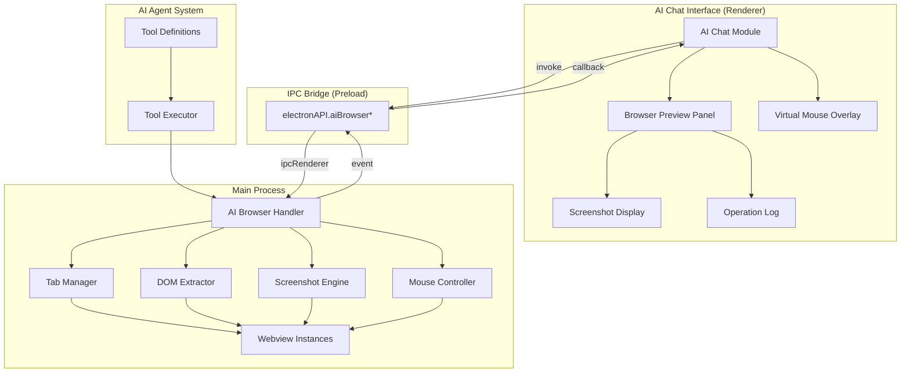
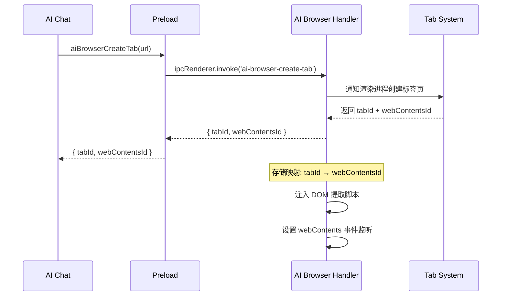
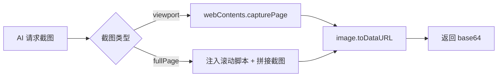
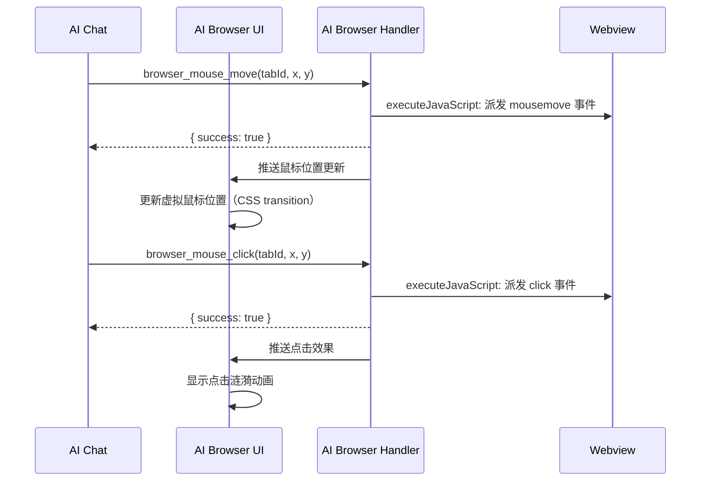
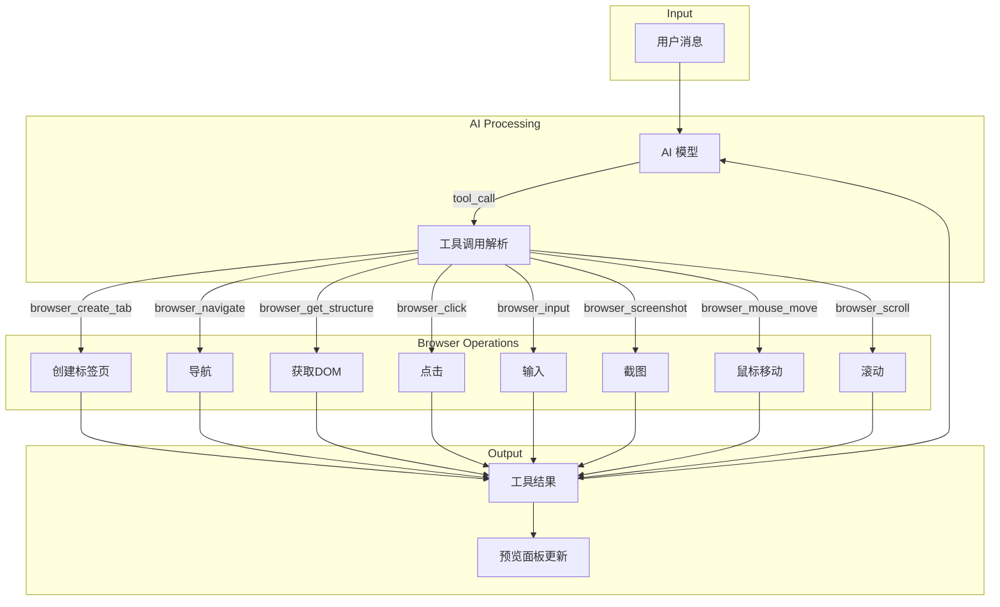
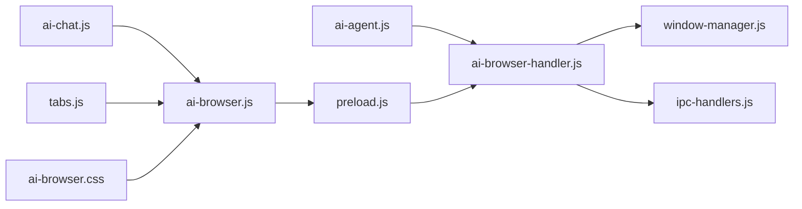

# DESIGN - AI 浏览器自动化系统架构设计

## 一、整体架构图



## 二、分层设计

### 2.1 主进程层 (Main Process)

#### ai-browser-handler.js
核心控制器，管理所有 AI 浏览器操作：

```
AIBrowserHandler
├── TabManager          # AI 代理标签页生命周期管理
│   ├── createTab()     # 创建 AI 代理标签页
│   ├── closeTab()      # 关闭标签页
│   ├── listTabs()      # 列出所有 AI 标签页
│   └── getWebContents() # 获取指定标签页的 webContents
│
├── DOMExtractor        # 页面结构提取
│   ├── getStructure()  # 提取完整 DOM 结构
│   ├── getText()       # 提取页面文本
│   ├── getForms()      # 提取表单结构
│   └── getInteractiveElements() # 提取可交互元素
│
├── ScreenshotEngine    # 截图引擎
│   ├── captureViewport() # 可视区域截图
│   ├── captureFullPage() # 全页面截图
│   └── captureElement()  # 元素截图
│
├── MouseController     # 鼠标控制器
│   ├── move()          # 移动虚拟鼠标
│   ├── click()         # 坐标点击
│   ├── drag()          # 拖拽操作
│   └── scroll()        # 滚动页面
│
└── ElementOperator     # 元素操作器
    ├── clickElement()  # 通过选择器点击
    ├── inputText()     # 输入文本
    └── selectOption()  # 选择下拉选项
```

### 2.2 渲染进程层 (Renderer Process)

#### ai-browser.js
前端 UI 模块，负责浏览器预览和交互：

```
AIBrowserUI
├── PreviewPanel        # 预览面板
│   ├── show()          # 显示预览
│   ├── hide()          # 隐藏预览
│   ├── updateScreenshot() # 更新截图
│   └── toggle()        # 切换显示/隐藏
│
├── VirtualMouse        # 虚拟鼠标
│   ├── moveTo()        # 移动到坐标
│   ├── showClick()     # 显示点击效果
│   └── showDrag()      # 显示拖拽轨迹
│
├── OperationLog        # 操作日志
│   ├── log()           # 记录操作
│   └── clear()         # 清除日志
│
└── ModeSwitcher        # 模式切换
    ├── setStandard()   # 切换到标准模式
    └── setMultimodal() # 切换到多模态模式
```

### 2.3 Preload 桥接层

扩展 `window.electronAPI`，暴露 AI 浏览器相关 API。

## 三、核心组件详细设计

### 3.1 AI 代理标签页管理



**关键实现**：
- AI 代理标签页在 tabs.js 中创建，标记 `isAiProxy = true`
- 主进程维护 `aiBrowserTabs: Map<tabId, { webContentsId, url, title }>`
- 标签页关闭时自动清理映射

### 3.2 DOM 结构提取

注入到 webview 的提取脚本：

```javascript
(function() {
  function generateSelector(el) {
    if (el.id) return '#' + el.id;
    if (el.className) {
      var classes = el.className.trim().split(/\s+/).join('.');
      var selector = el.tagName.toLowerCase() + '.' + classes;
      if (document.querySelectorAll(selector).length === 1) return selector;
    }
    // 生成路径选择器
    var path = [];
    while (el && el.nodeType === 1) {
      var sibling = el;
      var nth = 1;
      while (sibling = sibling.previousElementSibling) {
        if (sibling.tagName === el.tagName) nth++;
      }
      var tag = el.tagName.toLowerCase();
      path.unshift(tag + ':nth-of-type(' + nth + ')');
      el = el.parentElement;
    }
    return path.join(' > ');
  }

  var elements = [];
  document.querySelectorAll(
    'button, a, input, select, textarea, [onclick], [role="button"], [tabindex]'
  ).forEach(function(el) {
    var rect = el.getBoundingClientRect();
    if (rect.width > 0 && rect.height > 0) {
      elements.push({
        type: el.tagName.toLowerCase(),
        selector: generateSelector(el),
        text: (el.innerText || el.placeholder || '').substring(0, 200),
        boundingBox: {
          x: Math.round(rect.x),
          y: Math.round(rect.y),
          width: Math.round(rect.width),
          height: Math.round(rect.height)
        },
        visible: true,
        attributes: {
          id: el.id || undefined,
          type: el.type || undefined,
          href: el.href || undefined,
          placeholder: el.placeholder || undefined
        }
      });
    }
  });

  return {
    url: window.location.href,
    title: document.title,
    viewport: { width: window.innerWidth, height: window.innerHeight },
    scrollPosition: { x: window.scrollX, y: window.scrollY },
    documentHeight: document.documentElement.scrollHeight,
    elements: elements,
    links: Array.from(document.querySelectorAll('a[href]')).slice(0, 50).map(function(a) {
      return { text: a.innerText.substring(0, 100), href: a.href };
    }),
    headings: Array.from(document.querySelectorAll('h1,h2,h3')).slice(0, 20).map(function(h) {
      return { level: h.tagName, text: h.innerText.substring(0, 200) };
    })
  };
})()
```

### 3.3 截图引擎



**全页面截图策略**：
1. 注入脚本获取 `document.documentElement.scrollHeight`
2. 如果页面高度 > 视口高度，分多次截图拼接
3. 简化实现：先只支持可视区域截图，全页面截图通过滚动+多次截图实现

### 3.4 虚拟鼠标控制



## 四、数据流向图



## 五、异常处理策略

| 异常场景 | 处理方式 |
|----------|----------|
| webview 未加载完成 | 返回 `{ success: false, error: '页面尚未加载完成' }` |
| webContents 已销毁 | 清理映射，返回错误 |
| CSS 选择器匹配不到元素 | 返回 `{ success: false, error: '未找到匹配元素' }` |
| 截图失败 | 返回错误，不中断对话 |
| 导航超时 | 15秒超时，返回错误 |
| DOM 提取脚本执行失败 | try-catch 包裹，返回空结构 |
| 标签页被用户手动关闭 | 监听 close 事件，清理映射，通知 AI |

## 六、模块依赖关系



## 七、接口契约定义

### 7.1 主进程 IPC 接口

```typescript
// 创建 AI 代理标签页
ai-browser-create-tab(url: string, options?: object) 
  => { success: boolean, tabId: string, webContentsId: number }

// 关闭 AI 代理标签页
ai-browser-close-tab(tabId: string) 
  => { success: boolean }

// 列出 AI 代理标签页
ai-browser-list-tabs() 
  => { success: boolean, tabs: Array<{tabId, url, title}> }

// 导航
ai-browser-navigate(tabId: string, url: string) 
  => { success: boolean }

// 后退
ai-browser-go-back(tabId: string) 
  => { success: boolean }

// 前进
ai-browser-go-forward(tabId: string) 
  => { success: boolean }

// 获取页面结构
ai-browser-get-structure(tabId: string) 
  => { success: boolean, data: PageStructure }

// 点击元素
ai-browser-click-element(tabId: string, selector: string) 
  => { success: boolean }

// 输入文本
ai-browser-input-text(tabId: string, selector: string, text: string) 
  => { success: boolean }

// 选择下拉选项
ai-browser-select-option(tabId: string, selector: string, value: string) 
  => { success: boolean }

// 截图
ai-browser-screenshot(tabId: string, options?: {fullPage?: boolean}) 
  => { success: boolean, data: { image: string, viewport: object, mousePosition: object } }

// 鼠标移动
ai-browser-mouse-move(tabId: string, x: number, y: number) 
  => { success: boolean }

// 鼠标点击
ai-browser-mouse-click(tabId: string, x: number, y: number, button?: string) 
  => { success: boolean }

// 滚动
ai-browser-scroll(tabId: string, direction: string, amount: number) 
  => { success: boolean }

// 设置模式
ai-browser-set-mode(mode: 'standard' | 'multimodal') 
  => { success: boolean }
```

### 7.2 数据结构

```typescript
interface PageStructure {
  url: string;
  title: string;
  viewport: { width: number; height: number };
  scrollPosition: { x: number; y: number };
  documentHeight: number;
  elements: Array<{
    type: string;
    selector: string;
    text: string;
    boundingBox: { x: number; y: number; width: number; height: number };
    visible: boolean;
    attributes: Record<string, string>;
  }>;
  links: Array<{ text: string; href: string }>;
  headings: Array<{ level: string; text: string }>;
}

interface ScreenshotData {
  image: string; // base64 data URL
  viewport: { width: number; height: number };
  timestamp: number;
  mousePosition: { x: number; y: number };
}
```
