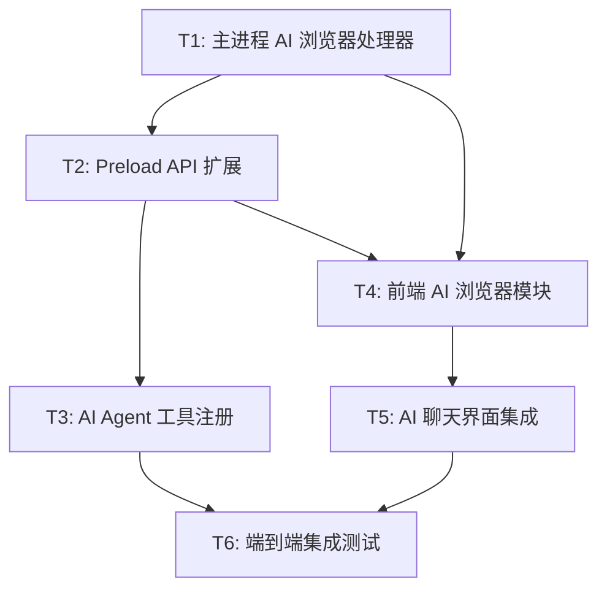

# TASK - AI 浏览器自动化系统原子化任务

## 任务依赖图

---

## T1: 主进程 AI 浏览器处理器

**文件**: `main/ai-browser-handler.js` (新增)

### 输入契约
- 前置依赖: 无（独立模块）
- 环境依赖: Electron 主进程环境

### 输出契约
- 导出 `registerAIBrowserHandlers()` 函数
- 注册所有 `ai-browser-*` IPC 处理器
- 维护 AI 代理标签页映射表

### 实现约束
- 使用 `var` 声明变量
- 通过 `getMainWindow()` 获取主窗口
- 通过 `webContents.fromId()` 操作 webview
- DOM 提取脚本通过 `executeJavaScript` 注入
- 截图使用 `webContents.capturePage()`
- 所有操作需 try-catch 包裹，返回统一格式 `{ success, data/error }`

### 验收标准
- [ ] 创建 AI 代理标签页并返回 tabId
- [ ] 关闭指定 AI 代理标签页
- [ ] 列出所有 AI 代理标签页
- [ ] 导航到指定 URL
- [ ] 前进/后退
- [ ] 获取页面 DOM 结构（元素、链接、标题）
- [ ] 通过 CSS 选择器点击元素
- [ ] 通过 CSS 选择器输入文本
- [ ] 通过 CSS 选择器选择下拉选项
- [ ] 可视区域截图返回 base64
- [ ] 坐标鼠标移动和点击
- [ ] 页面滚动
- [ ] 模式切换
- [ ] 标签页关闭时自动清理映射
- [ ] webContents 销毁时返回友好错误

---

## T2: Preload API 扩展

**文件**: `preload.js` (修改)

### 输入契约
- 前置依赖: T1（需要 IPC handler 已注册）

### 输出契约
- 在 `window.electronAPI` 上暴露所有 `aiBrowser*` 方法
- 包含 invoke 方法和 on 事件监听

### 实现约束
- 使用 `ipcRenderer.invoke` 调用主进程
- 使用 `ipcRenderer.on` 监听主进程推送
- API 命名遵循现有 `camelCase` 规范

### 验收标准
- [ ] 暴露 `aiBrowserCreateTab(url, options)`
- [ ] 暴露 `aiBrowserCloseTab(tabId)`
- [ ] 暴露 `aiBrowserListTabs()`
- [ ] 暴露 `aiBrowserNavigate(tabId, url)`
- [ ] 暴露 `aiBrowserGoBack(tabId)`
- [ ] 暴露 `aiBrowserGoForward(tabId)`
- [ ] 暴露 `aiBrowserGetStructure(tabId)`
- [ ] 暴露 `aiBrowserClickElement(tabId, selector)`
- [ ] 暴露 `aiBrowserInputText(tabId, selector, text)`
- [ ] 暴露 `aiBrowserSelectOption(tabId, selector, value)`
- [ ] 暴露 `aiBrowserScreenshot(tabId, options)`
- [ ] 暴露 `aiBrowserMouseMove(tabId, x, y)`
- [ ] 暴露 `aiBrowserMouseClick(tabId, x, y, button)`
- [ ] 暴露 `aiBrowserScroll(tabId, direction, amount)`
- [ ] 暴露 `aiBrowserSetMode(mode)`
- [ ] 暴露 `onAIBrowserScreenshot(cb)` 事件监听
- [ ] 暴露 `onAIBrowserMouseUpdate(cb)` 事件监听

---

## T3: AI Agent 工具注册

**文件**: `main/ai-agent.js` (修改), `main/ipc-handlers.js` (修改)

### 输入契约
- 前置依赖: T1, T2

### 输出契约
- 8 个浏览器工具添加到 `TOOL_DEFINITIONS`
- `executeTool` 中添加 browser_* 分支
- `ipc-handlers.js` 中注册 AI 浏览器处理器

### 实现约束
- 工具定义格式与现有工具一致
- risk 等级: 浏览器操作统一为 risk=1
- 工具执行调用 `ai-browser-handler` 的方法

### 验收标准
- [ ] `browser_create_tab` 工具注册并可调用
- [ ] `browser_navigate` 工具注册并可调用
- [ ] `browser_screenshot` 工具注册并可调用
- [ ] `browser_click` 工具注册并可调用
- [ ] `browser_input` 工具注册并可调用
- [ ] `browser_get_structure` 工具注册并可调用
- [ ] `browser_mouse_move` 工具注册并可调用
- [ ] `browser_scroll` 工具注册并可调用
- [ ] AI 对话中可通过 FC 或文本解析调用浏览器工具
- [ ] 工具结果正确返回到 AI 对话

---

## T4: 前端 AI 浏览器模块

**文件**: `src/js/modules/ai-browser.js` (新增), `src/css/ai-browser.css` (新增)

### 输入契约
- 前置依赖: T2（需要 preload API）
- 环境依赖: 渲染进程，FBrowser 全局命名空间

### 输出契约
- `window.FBrowser.aiBrowser` 模块
- 浏览器预览面板 UI
- 虚拟鼠标叠加层
- 操作日志面板
- 模式切换控件

### 实现约束
- IIFE 模块封装
- 使用 `var` 声明
- CSS 使用 CSS 变量（`var(--bg-0)` 等）
- 虚拟鼠标使用 CSS transition 动画
- 截图使用 `` 标签显示 base64

### 验收标准
- [ ] 预览面板可显示/隐藏/折叠
- [ ] 截图正确显示在预览面板
- [ ] 虚拟鼠标位置与 AI 操作同步
- [ ] 点击涟漪动画效果
- [ ] 操作日志记录和显示
- [ ] 标准/多模态模式切换
- [ ] 响应式布局适配

---

## T5: AI 聊天界面集成

**文件**: `src/js/modules/ai-chat.js` (修改), `src/index.html` (修改), `src/js/modules/tabs.js` (修改)

### 输入契约
- 前置依赖: T4（需要前端模块）

### 输出契约
- AI 聊天界面底部集成浏览器预览面板
- AI 代理标签页在标签栏显示特殊标识
- 标签页系统支持 `isAiProxy` 标记

### 实现约束
- 不破坏现有 AI 聊天功能
- 预览面板默认折叠，AI 操作浏览器时自动展开
- AI 代理标签页有视觉区分（图标/颜色）

### 验收标准
- [ ] AI 聊天界面显示浏览器预览面板
- [ ] AI 调用浏览器工具时预览面板自动展开
- [ ] 截图工具返回时更新预览面板
- [ ] AI 代理标签页在标签栏有特殊标识
- [ ] 用户可手动关闭 AI 代理标签页
- [ ] index.html 引入 ai-browser.css

---

## T6: 端到端集成测试

### 输入契约
- 前置依赖: T1-T5 全部完成

### 输出契约
- 完整功能验证

### 验收标准
- [ ] AI 可通过对话创建浏览器标签页
- [ ] AI 可导航到网页并获取页面结构
- [ ] AI 可点击页面元素
- [ ] AI 可在输入框输入文本
- [ ] AI 可截取页面截图
- [ ] 截图在预览面板正确显示
- [ ] 虚拟鼠标在多模态模式下工作
- [ ] 标签页关闭时资源正确释放
- [ ] 错误场景有友好提示
